# Nothing Theme

Custom terminal, editor, CLI, and wallpaper theme based on the Nothing design language: warm monochrome, strong typography, and one molten accent color.

The repo ships two theme variants:

- `nothing-light`: pure white canvas, near-black foreground, WCAG-conscious ANSI colors.
- `nothing-dark`: OLED-ready near-black base with warm parchment foreground.

The shared accent is `#FF4719`. It is reserved for high-signal UI states such as cursors, active pane borders, and active window indicators.

## Preview

| Nothing Light | Nothing Dark |
| --- | --- |
| [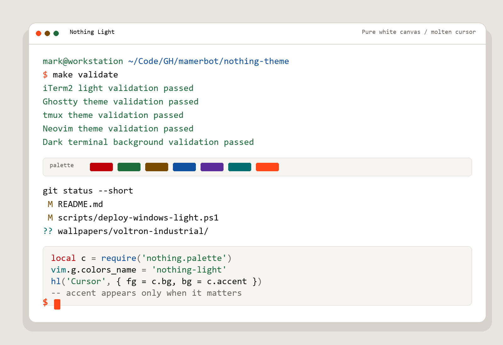](assets/nothing-light-terminal.png) | [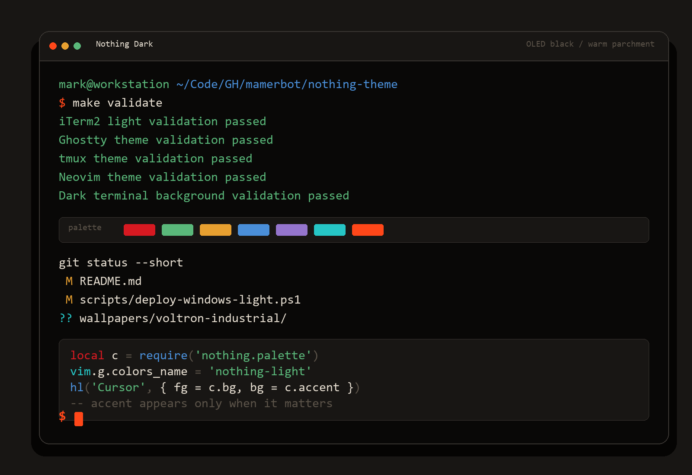](assets/nothing-dark-terminal.png) |

## Included Targets

| App | Light file | Dark file |
| --- | --- | --- |
| iTerm2 color presets | `home/.config/iterm2/colors/nothing-light.itermcolors` | `home/.config/iterm2/colors/nothing-dark.itermcolors` |
| iTerm2 Dynamic Profiles | `home/.config/iterm2/DynamicProfiles/nothing-light.json` | `home/.config/iterm2/DynamicProfiles/nothing-dark.json` |
| Ghostty | `home/.config/ghostty/themes/nothing-light` | `home/.config/ghostty/themes/nothing-dark` |
| tmux | `home/.config/tmux/themes/nothing-light.conf` | `home/.config/tmux/themes/nothing-dark.conf` |
| Neovim | `home/.config/nvim/colors/nothing-light.lua` | `home/.config/nvim/colors/nothing-dark.lua` |
| eza | `home/.config/eza/themes/nothing-light.yml` | `home/.config/eza/themes/nothing-dark.yml` |
| delta | `home/.config/delta/themes/nothing-light.gitconfig` | `home/.config/delta/themes/nothing-dark.gitconfig` |
| lazygit | `home/.config/lazygit/themes/nothing-light.yml` | `home/.config/lazygit/themes/nothing-dark.yml` |

## Wallpapers

The current wallpaper set lives under `wallpapers/`.

### Voltron Industrial

`wallpapers/voltron-industrial/` is the newer wallpaper family and includes light/dark full-size PNGs plus thumbnail JPGs for each design. The manifest at `wallpapers/voltron-industrial/manifest.json` names `aperture` as the default vibe.

Gallery:

| Vibe | Light | Dark |
| --- | --- | --- |
| Aperture | [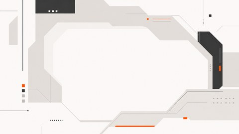](wallpapers/voltron-industrial/aperture/light.png) | [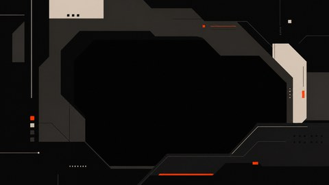](wallpapers/voltron-industrial/aperture/dark.png) |
| Containment Frame | [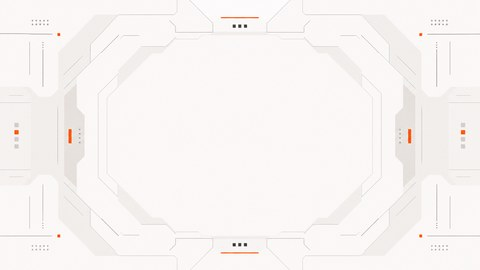](wallpapers/voltron-industrial/containment-frame/light.png) | [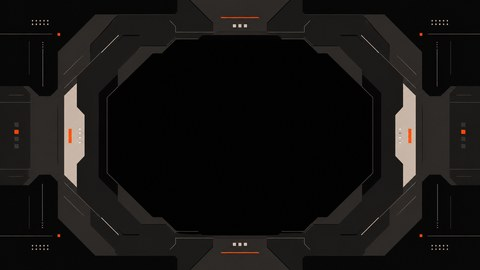](wallpapers/voltron-industrial/containment-frame/dark.png) |
| Diagonal Corridor | [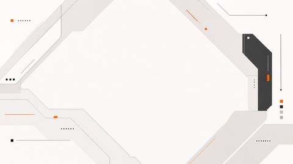](wallpapers/voltron-industrial/diagonal-corridor/light.png) | [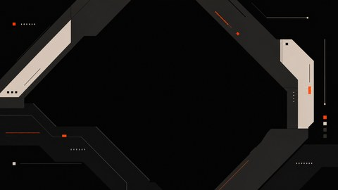](wallpapers/voltron-industrial/diagonal-corridor/dark.png) |
| Gantry | [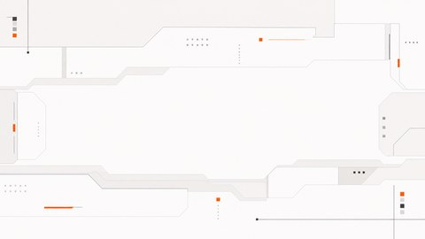](wallpapers/voltron-industrial/gantry/light.png) | [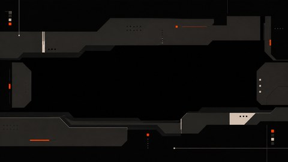](wallpapers/voltron-industrial/gantry/dark.png) |
| Horizontal Trench | [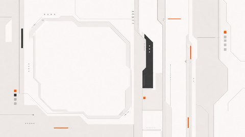](wallpapers/voltron-industrial/horizontal-trench/light.png) | [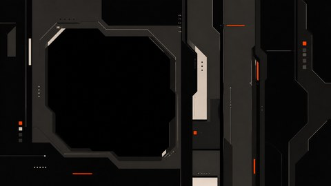](wallpapers/voltron-industrial/horizontal-trench/dark.png) |

On Windows, `make install` installs and applies `wallpapers/voltron-industrial/aperture/light.png` as the default wallpaper at `Pictures/Nothing Theme/nothing-voltron-industrial-aperture-light.png`.

### Legacy Generated Wallpapers

The root `wallpapers/` directory also keeps the earlier generated SVG/PNG designs:

- cube patterns in coarse, medium, and fine variants
- Penrose patterns in coarse, medium, and fine variants
- `nothing-dark-descent`
- `nothing-dark-meridian`
- `nothing-dark-signal`
- `nothing-dark-terminal`
- `nothing-light-figureground`

## Install

Bare `make` runs validation only.

```sh
make
```

Install all managed terminal, editor, and CLI themes:

```sh
make install
```

Deploy all managed terminal, editor, and CLI themes:

```sh
make deploy
```

Install one target:

```sh
make install-ghostty
make install-nvim
make install-tmux
make install-eza
make install-delta
make install-lazygit
make install-iterm2
```

On Windows, the Makefile uses PowerShell wrappers. `make install` installs all managed themes, activates the light variant where supported by the helper, applies Windows light mode, and sets the default Voltron Industrial Aperture light wallpaper. `make install-wallpapers` copies the default wallpaper into `Pictures/Nothing Theme/` without changing system appearance.

## Manual Activation

Ghostty:

```text
theme = nothing-light
```

```text
theme = nothing-dark
```

Or switch with system appearance:

```text
theme = light:nothing-light,dark:nothing-dark
```

tmux:

```tmux
source-file ~/.config/tmux/themes/nothing-light.conf
```

```tmux
source-file ~/.config/tmux/themes/nothing-dark.conf
```

Neovim:

```vim
colorscheme nothing-light
```

```vim
colorscheme nothing-dark
```

eza loads `~/.config/eza/theme.yml`, so activate a variant by copying or symlinking:

```sh
ln -sf ~/.config/eza/themes/nothing-light.yml ~/.config/eza/theme.yml
```

delta:

```gitconfig
[include]
    path = ~/.config/delta/themes/nothing-light.gitconfig
[delta]
    features = nothing-light
```

lazygit does not have a dedicated theme search path. Merge the preferred snippet from `home/.config/lazygit/themes/` into `~/.config/lazygit/config.yml`.

## Validation

Validation checks color values, required config keys, and dark-mode background consistency.

```sh
make validate
```
